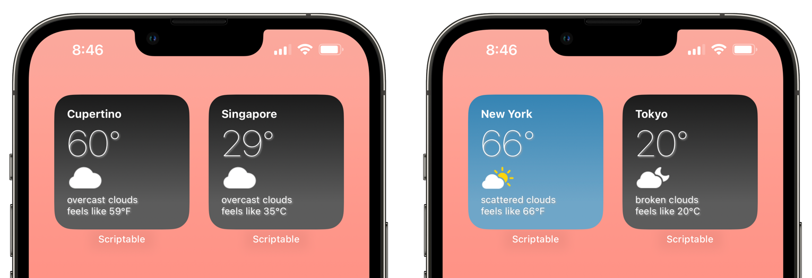

# openweathermap.js



A module to encapsulate OpenWeatherMap's [One Call API](https://openweathermap.org/api/one-call-api) and additional information shared by developers over the Automators.fm community.

[Source](../source/openweathermap.js) | [Import](https://open.scriptable.app/run/Import-Script?url=https://github.com/supermamon/scriptable-scripts/source/openweathermap.js)

---

## Features

* Automatic location detection or custom coordinates
* Night time detection
* SFSymbol names for weather conditions
* Units information
* OpenWeatherMap icon urls

## Excluded

* minutely forcast

--- 

## Syntax

Below are some example usage of the module.

**Automatic location detection**  

By not providing coordinates (`lat`, `lon`), location will be automatically detected.

```javascript
const API_KEY = 'your-api-key'
const owm = importModule('openweathermap.js')
const weatherData = await owm({appid: API_KEY})
```

**Automatic location detection & reverse geocoding**

`revgeocode` will search for the address information based on the detected location.

```javascript
const API_KEY = 'your-api-key'
const owm = importModule('openweathermap.js')
const weatherData = await owm({appid: API_KEY, revgeocode:true})
```

**Specified coordinates**

Provide coordinates to disable location detection. 

```javascript
const API_KEY = 'your-api-key'
const owm = importModule('openweathermap.js')
const weatherData = await owm({appid: API_KEY, lat: 37.32, lon: -122.03})
```

**Localization**

You can pass the pass `lang` and `units` as options to receive alternative results.
Defaults are `en` and `metric` respectively.

```javascript
const API_KEY = 'your-api-key'
const owm = importModule('openweathermap.js')
const weatherData = await owm({appid: API_KEY, lang: 'fr', units: 'metric'})
```
**Other Parameters**

* `location_name` - automatic location name search (`revgeocode`) can be turned of the location name may be manually provided via this parameter
* `exclude` - comma-separate values of forecasts to exclude. Accepted options are `daily` and `hourly`. `minutely` and `alerts` is automatically always excluded.
* `api_version` - This module was initially created at the time where version 1.0 (a.k.a 2.5) of the [One Call API](https://openweathermap.org/api/one-call-api) is current. With the release of [One Call API 3.0](https://openweathermap.org/api/one-call-3) this parameter is provided so users of this module have the flexibility to change.

--- 

## Additional Data Returned

The properties below are not part of the API but are returned by this module.

These values depend on the `units` parameter. Information is based from the [Units of Measurement](https://openweathermap.org/api/one-call-api#data) documentation.
```javascript
.units: {
    temp 
    pressure
    visibility
    wind_speed
    wind_gust
    rain
    snow
}
```

Any of the arguments passed when the function is called are available in the `.args` method. This also include arguments with default values.

```javascript
.args: {
    appid
    api_version
    units
    lang
    lat
    lon
    revgeocode
    location_name
    exclude
}
```

Nighttime and SFSymbol information fields under the `current`, `daily` and `hourly` properties

* `.is_night` - boolean to signify whether the current condition is during night time
* `.weather[0].sfsymbol` - SFSymbol name to represent the weather conditions. This is an alternative to `.weather[0].icon`.
* `.icon_url` - the [icon url](https://openweathermap.org/weather-conditions#How-to-get-icon-URL) provided by OpenWeatherMap


--- 

## Example

* [simple-weather-widget.js](../source/simple-weather-widget.js) - a weather widget that uses this module. 

